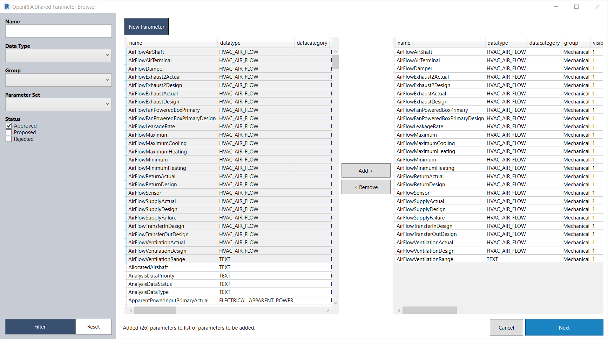

# OpenRFA Tookit

The OpenRFA Toolkit is a suite of Revit add-ins which seek to utilize the OpenRFA standard shared parameters.

## Load Shared Parameters

This set of add-ins give users the ability to load OpenRFA shared parameters in batch.

The add-in connects to the live database on OpenRFA.org to verify that the user has the most up-to-date shared parameter definitions. If the local version of the definitions are out of date, the user has the option to download the most recent definitions from OpenRFA.org.

The Shared Parameter Browser also includes an early implementation of how [Parameter Sets](http://openrfa.org/documentation/parameter-sets) can be leveraged. In this add-in, there is an option to filter by Parameter Set, so that a user can choose to load an entire set of shared parameters in batch.

### Load Parameters To Current

This tool allows users to load a set of shared parameters into the currently open Revit family. Note that your Revit instance must have a Revit family (rfa) open and active to use this tool.

### Load Parameters To Multiple Families

This tool features the ability to load multiple shared parameters to *multiple families*. Rather than loading the parameters into the current Revit family, the user will be prompted to select multiple Revit families (rfa files). The add-in will then add all shared parameters to the selected families in batch.